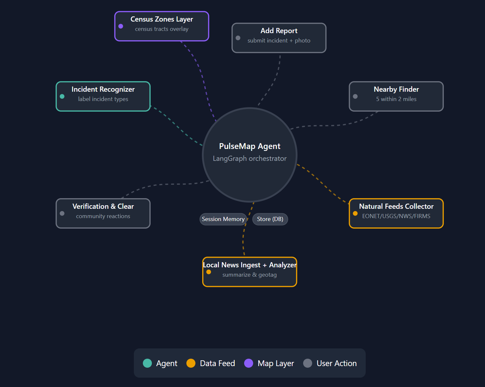

# PulseMap Agent — Map‑First Incident Intelligence (FastAPI + React)

A lightweight, **map‑first incident agent** that blends **community reports** with **official hazard feeds** and simple **Verify / Clear** reactions, so neighborhoods can stay informed in seconds.

This project is designed as a **data → ingestion → classification → serving** pipeline, with attention to:

- A clear **architecture sketch** (web → API → agents → SQLite → map)
- **Production concerns** (latency budgets, rate limits, basic SLO thinking)
- **Cloud‑friendly deployment** (FastAPI, Vite, Google Maps, env‑driven config)
- **MLOps / Ops awareness** (observability hooks, postmortem notes, predictable API surface)

<p>
  <!-- Backend / Agents -->
  
  
  
  
  
  
  <!-- Frontend / Map -->
  
  
  
  
</p>

**▶ Watch the 2‑min demo:**  
[](https://vimeo.com/1114405956?share=copy#t=0)

---

## Table of Contents

- [Architecture & Data Flow](#architecture--data-flow)
- [Production Readiness & Metrics](#production-readiness--metrics)
- [Deployment & Cloud Infrastructure](#deployment--cloud-infrastructure)
- [Features](#features)
- [Getting Started](#getting-started)
  - [Prerequisites](#prerequisites)
  - [Backend (FastAPI)](#backend-fastapi)
  - [Frontend (Vite + React)](#frontend-vite--react)
- [Environment Variables](#environment-variables)
- [API Reference](#api-reference)
- [Typical Flow](#typical-flow)
- [Troubleshooting & Example Postmortem](#troubleshooting--example-postmortem)
- [Roadmap](#roadmap)
- [Contributing](#contributing)
- [License](#license)
- [Acknowledgements](#acknowledgements)

---

## Architecture & Data Flow

At a high level, PulseMap is a **map + agent** wrapped around a thin API and a small SQLite store.

1. **Data sources**
   - **User reports**: incidents dropped on the map, optionally with photos.
   - **Official feeds**: USGS quakes, NWS alerts, NASA EONET, FIRMS fire hotspots.
2. **Ingestion & storage**
   - Normalized into a common schema and persisted in **SQLite**.
   - Photos written under a configurable `PULSEMAP_DATA_DIR` (`./data` by default).
3. **Classification & routing (agents)**
   - LangGraph / LangChain agent does:
     - Intent classification (add report vs. “what’s nearby?”).
     - Nearby incident lookup (tools for `/updates/local`).
     - Optional summarization of tool results for chat UX.
4. **Serving**
   - **FastAPI** exposes REST endpoints:
     - `/updates/*` to slice map data.
     - `/reports/*` and `/reports/reactions` for user reports / Verify / Clear.
     - `/feeds/*` for direct feed debugging.
     - `/geo/*` for census tract polygons.
   - All responses optimized for a **map UX** (GeoJSON where appropriate).
5. **Web UI**
   - **React + TypeScript + Vite**, using `@vis.gl/react-google-maps` for map rendering.
   - A nearby modal, sidebar cards, and simple filters sit on top of the API.

```text
Browser (React/Vite/Google Maps)
        ↓  HTTP (JSON/GeoJSON)
FastAPI API layer
        ↓
Agents (LangGraph / LangChain)
        ↓
SQLite + file storage (data/, photos)
        ↑
Official feeds (USGS / NWS / EONET / FIRMS)
```

The architecture keeps the system small enough to run on a single machine while still looking like a simplified slice of a real‑world incident intelligence system.

---

## Production Readiness & Metrics

### Latency & User Experience

Rough latency budgets when deployed on a small VM:

- **Map + UI load (cold)**: dominated by JS bundle + Google Maps (~hundreds of ms).
- **Nearby incidents fetch** (`/updates/local`):
  - DB query + basic joins: _tens of ms_ on SQLite.
  - Network + JSON marshalling: _sub‑100ms_ on a local network.
- **Chat / agent calls** (if used):
  - LLM latency is the main contributor.

Example latency goals:

- p95 for `/updates/local` under **300–400 ms** for a single region.
- p95 for Verify / Clear reactions (`/reports/{rid}/react`) under **200 ms**.

The code is structured so you can wrap endpoints with metrics middleware (e.g., logging duration per route, status code, and size) and export to Prometheus / CloudWatch.

### Rate Limits & Safety

Third‑party feeds (USGS, NWS, EONET, FIRMS) usually have suggested polling windows. PulseMap is structured so that:

- **Polling logic** can be centralized (cron / background job) and cached.
- Map endpoints (`/updates/*`) can read from that cache instead of hitting APIs on every page load.

A production deployment can:
- Add **request rate limiting** per IP on `/updates/*` and `/chat`.
- Cache feed responses for a few minutes to avoid over‑polling.

### Data Quality & Simple Evaluations

Some practical checks you can add:

- **Duplicate incident detection**: compare new reports against nearby existing ones in the last N minutes.
- **Feed sanity checks**: count events per feed per hour; alert if it suddenly drops to zero or spikes far above usual.

---

## Deployment & Cloud Infrastructure

PulseMap is designed to be **cloud‑friendly** without requiring heavy infra.

**Baseline stack**

- **Backend**: FastAPI + Uvicorn
- **DB**: SQLite (can be swapped for Postgres without changing the API surface)
- **Frontend**: Vite‑built React app served by:
  - A static host (S3 + CloudFront, GCS + CDN, Netlify, etc.), or
  - The same container / process in a small deployment.

**Example deployment layout**

- Package backend as a **Docker image**.
- Run behind a load balancer or API gateway (AWS ALB / API Gateway, GCP HTTPS LB).
- Store uploads in object storage (S3 / GCS) instead of local disk.
- Move from SQLite → Postgres for multi‑instance scaling.

---

## Features

- **Add reports** (crime, accident, missing item, hazards) with optional photo; drops a marker instantly.
- **Verify / Clear** with per‑session memory to prevent re‑nagging; live counts on each report.
- **Nearby pop‑ups:** auto‑surfaces up to **5 reports within 2 miles** when a user opens the app.
- **Official feeds:** USGS quakes, NWS alerts, NASA EONET, FIRMS fire hotspots — merged into one map.
- **Census zones layer:** tints polygons by incident severity for quick context.
- **Agentic flow (LangGraph + LangChain):** classify reports, route actions, summarize tool results.
- **FastAPI + SQLite:** simple to run locally; optional photo uploads stored under `/data`.

---

## Getting Started

### Prerequisites

- Python **3.10+**
- Node.js **18+** and npm
- A **Google Maps API key** (Maps JavaScript API enabled)

### Backend (FastAPI)

```bash
# optional: create a virtualenv
python -m venv .venv && source .venv/bin/activate   # Windows: .venv\Scripts\activate
pip install -r requirements.txt
uvicorn apps.api.main:app --reload
```

API runs at **http://localhost:8000**.

### Frontend (Vite + React)

Create `apps/web/.env`:

```bash
VITE_API_BASE=http://localhost:8000
VITE_GOOGLE_MAPS_API_KEY=YOUR_MAPS_KEY
```

Then:

```bash
cd apps/web
npm install
npm run dev
```

Open the printed URL (typically **http://localhost:5173**).

---

## Environment Variables

**Frontend**

- `VITE_API_BASE` — FastAPI base URL (default `http://localhost:8000`)
- `VITE_GOOGLE_MAPS_API_KEY` — Maps JS API key

**Backend** (examples; adapt to your project)

- `PULSEMAP_DATA_DIR` — where photos/uploads are stored (default: `./data`)
- Provider‑specific keys as needed if you add authenticated feeds.

---

## API Reference

> Base URL: `http://localhost:8000`

### Health

**GET** `/health` → `{ ok: true, time: <ISO> }`

### Updates (nearby/global slices)

**GET** `/updates/local?lat=<num>&lon=<num>&radius_miles=<num>&limit=<int>&max_age_hours=<int>`  
Returns a JSON object with `count` and `updates` (user reports + official feeds) near a point.

**GET** `/updates/global?limit=<int>&max_age_hours=<int>`  
Returns recent global updates.

### Reports (collection)

**GET** `/reports`  
Returns a **GeoJSON FeatureCollection** of user reports.

**POST** `/reports/clear` *(dev utility)*  
Clears all stored reports.

### Reactions (Verify / Clear)

**POST** `/reports/{rid}/react`  
Body:

```json
{ "action": "verify" | "clear", "value": true, "session_id": "<client-session-id>" }
```

Toggles a reaction for the current session, returns updated counts.

**GET** `/reports/reactions?ids=rid1,rid2&session_id=<id>`  
Returns counts and `me` flags for each `rid`.

### Feeds (official sources)

**GET** `/feeds/usgs` — USGS earthquakes (GeoJSON passthrough/normalized)  
**GET** `/feeds/nws` — NWS weather alerts  
**GET** `/feeds/eonet` — NASA EONET events  
**GET** `/feeds/firms` — FIRMS fire hotspots

> These are used by the backend to build `/updates/*`; they can also be called directly for debugging.

### Geo (census tracts)

**GET** `/geo/tracts?bbox=<west,south,east,north>`  
Returns **GeoJSON** polygons for tracts intersecting the bounding box. Used for the zones layer.

### Uploads (photos)

**POST** `/upload/photo` *(multipart/form-data)*  
Field: `file` (image). Returns `{ "photo_url": "..." }` for use in report properties.

### Chat (agent entrypoint)

**POST** `/chat`  
Agent endpoint that interprets a message (e.g., “add a report” vs “what’s nearby?”) and may call tools.  
*Payload shape may differ by implementation; see `apps/api/routers/chat.py`.*

### Config

**GET** `/config` or `/config/public` *(if present)*  
Expose safe config for the frontend (e.g., non‑secret flags).

---

## Typical Flow

1. **User adds a report** (optionally with a photo) → marker appears immediately; classifier assigns category; severity may tint the zone.
2. **Another user nearby** opens the app → **Nearby modal** surfaces up to 5 incidents within 2 miles with **Verify / Clear / Skip**.
3. **Reactions update** in real time and are **session‑aware** (no double prompts).
4. **Official feeds** continuously enrich the map; `/updates/*` merges everything into one view.

---

## Troubleshooting & Example Postmortem

### Common Issues

- **Map blank**
  - Check `VITE_GOOGLE_MAPS_API_KEY` and that the Maps JS API is enabled for your key.
- **Nearby modal not showing**
  - Ensure geolocation permission is granted; confirm `/updates/local` returns items with `kind: "report"` and a valid `rid`.
- **No Verify/Clear buttons**
  - The item must be a user `report` with a `rid`; confirm backend stamps `properties.rid`.
- **CORS errors**
  - Add your web origin to the CORS allow‑list in the FastAPI app.
- **Uploads failing**
  - Ensure `data/` directory exists and the API process can write to it.

### Example Postmortem: Duplicate Nearby Prompts

**Symptom**  
Nearby users reported being “spammed” by repeated Verify / Clear prompts for the same incident whenever they reopened the app.

**Analysis**

- The `/reports/{rid}/react` endpoint was working and storing reactions.
- `/reports/reactions` returned the correct `me` flags when called with the expected `session_id`.
- The frontend sometimes generated a new `session_id` on page reload instead of persisting it.

**Root Cause**

- `session_id` was not persisted across browser sessions (no durable storage), so the backend saw each visit as a new session and showed Verify / Clear prompts again.

**Fix**

- Persisted `session_id` in localStorage and reused it across reloads.
- Added a simple helper to generate a session id only if none exists.
- Verified in dev tools that repeated visits kept the same `session_id` and that `/reports/reactions` correctly flagged reports as already handled by “me”.

Documenting this kind of issue makes it clear how PulseMap behaves under real usage and how bugs are investigated and resolved.

---

## Roadmap

- Add a **background feed poller** (cron / worker) with caching instead of on‑demand fetches.
- Swap SQLite for **Postgres** behind a shared API for multi‑instance deployments.
- Add **basic metrics middleware** (latency per route, error counts, feed poll success rates).
- Expose a lightweight **admin dashboard** for feed status and incident rates.
- Integrate a **simple rules engine** (e.g., per neighborhood alert thresholds).

---

## Contributing

PRs and issues are welcome. For larger changes, open an issue to discuss API and architecture first.

**Code style:** small composable functions; clear names; typed TS on the frontend; docstrings on routers/tools.

---

## License

MIT — see `LICENSE`.

---

## Acknowledgements

USGS, NWS, NASA EONET, FIRMS for public hazard data; `@vis.gl/react-google-maps`; the LangChain & LangGraph communities.
