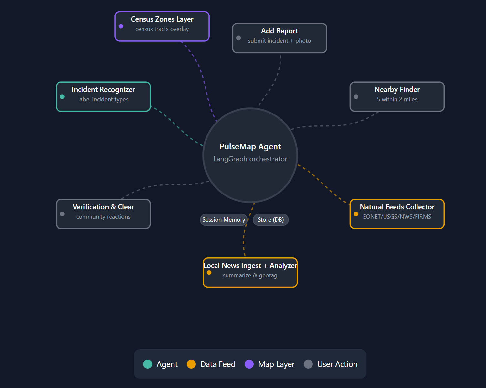

# PulseMap Agent

A lightweight, map‑first agent that blends **community reports** with **official hazard feeds** and simple **verify/clear** reactions, so neighborhoods can stay informed in seconds.

<p>
  <!-- Backend / Agents -->
  
  
  
  
  
  
  <!-- Frontend / Map -->
  
  
  
  
</p>

**▶ Watch the 2‑min demo:** <br>
[](https://vimeo.com/1114405956?share=copy#t=0)

---

## Features

- **Add reports** (crime, accident, missing item, hazards) with optional photo; drops a marker instantly.
- **Verify / Clear** with per‑session memory to prevent re‑nagging; live counts on each report.
- **Nearby pop‑ups:** auto‑surfaces up to **5 reports within 2 miles** when a user opens the app.
- **Official feeds:** USGS quakes, NWS alerts, NASA EONET, FIRMS fire hotspots — merged into one map.
- **Census zones layer:** tints polygons by incident severity for quick context.
- **Agentic flow (LangGraph + LangChain):** classify reports, route actions, summarize tool results.
- **FastAPI + SQLite:** simple to run locally; optional photo uploads stored under `/data`.

---

## Architecture (quick)

- **Web (React + TS + Vite):** Google Maps via `@vis.gl/react-google-maps`, nearby modal, sidebar cards.
- **API (FastAPI):** `/updates/local|global`, `/reports/*`, `/reports/reactions`, `/geo/tracts`, `/upload/photo`, `/feeds/*`, `/chat`.
- **Agents (LangGraph/LangChain):** add_report tool, find_nearby tool, incident classifier, feeds pollers.
- **Store (SQLite):** reports table, reactions table; images saved to `data/` (or object storage in prod).

---

## Getting Started

### Prerequisites
- Python **3.10+**
- Node.js **18+** and npm
- A **Google Maps API key** (Maps JavaScript API enabled)

### 1) Clone
```bash
git clone <YOUR_REPO_URL>
cd PulseMap-Agent
```

### 2) Backend (FastAPI)
```bash
# optional: create a virtualenv
python -m venv .venv && source .venv/bin/activate   # Windows: .venv\Scripts\activate
pip install -r requirements.txt  # or: pip install fastapi uvicorn pydantic python-dateutil
uvicorn apps.api.main:app --reload
```
API runs at **http://localhost:8000**.

### 3) Frontend (Vite + React)
Create `apps/web/.env`:
```bash
VITE_API_BASE=http://localhost:8000
VITE_GOOGLE_MAPS_API_KEY=YOUR_MAPS_KEY
```
Then:
```bash
cd apps/web
npm install
npm run dev
```
Open the printed URL (typically **http://localhost:5173**).

---

## Environment Variables

**Frontend**
- `VITE_API_BASE` — FastAPI base URL (default `http://localhost:8000`)
- `VITE_GOOGLE_MAPS_API_KEY` — Maps JS API key

**Backend** (examples; adapt to your project)
- `PULSEMAP_DATA_DIR` — where photos/uploads are stored (default: `./data`)
- Other provider keys as needed for feeds (if you add authenticated sources)

---

## API Reference

> Base URL: `http://localhost:8000`

### Health
**GET** `/health` → `{ ok: true, time: <ISO> }`

### Updates (nearby/global slices)
**GET** `/updates/local?lat=<num>&lon=<num>&radius_miles=<num>&limit=<int>&max_age_hours=<int>`  
Returns a JSON object with `count` and `updates` (user reports + official feeds) near a point.

**GET** `/updates/global?limit=<int>&max_age_hours=<int>`  
Returns recent global updates.

### Reports (collection)
**GET** `/reports`  
Returns a **GeoJSON FeatureCollection** of user reports.

**POST** `/reports/clear` *(dev utility)*  
Clears all stored reports.

### Reactions (verify/clear)
**POST** `/reports/{rid}/react`  
Body:
```json
{ "action": "verify" | "clear", "value": true, "session_id": "<client-session-id>" }
```
Toggles a reaction for the current session, returns updated counts.

**GET** `/reports/reactions?ids=rid1,rid2&session_id=<id>`  
Returns counts and `me` flags for each `rid`.

### Feeds (official sources)
**GET** `/feeds/usgs` — USGS earthquakes (GeoJSON passthrough/normalized)  
**GET** `/feeds/nws` — NWS weather alerts  
**GET** `/feeds/eonet` — NASA EONET events  
**GET** `/feeds/firms` — FIRMS fire hotspots

> These are used by the backend to build `/updates/*`; they can also be called directly for debugging.

### Geo (census tracts)
**GET** `/geo/tracts?bbox=<west,south,east,north>`  
Returns **GeoJSON** polygons for tracts intersecting the bounding box. Used for the zones layer.

### Uploads (photos)
**POST** `/upload/photo` *(multipart/form-data)*  
Field: `file` (image). Returns `{ "photo_url": "..." }` for use in report properties.

### Chat (agent entrypoint)
**POST** `/chat`  
Agent endpoint that interprets a message (e.g., “add a report” vs “what’s nearby”) and may call tools.  
*Payload shape may differ by implementation; see `apps/api/routers/chat.py`.*

### Config
**GET** `/config` or `/config/public` *(if present)*  
Expose safe config for the frontend (e.g., non-secret flags).

---

## Typical Flow

1. **User adds a report** (optionally with a photo) → marker appears immediately; classifier assigns category; severity may tint the zone.
2. **Another user nearby** opens the app → **Nearby modal** surfaces up to 5 incidents within 2 miles with **Verify / Clear / Skip**.
3. **Reactions update** in real time and are **session-aware** (no double prompts).
4. **Official feeds** continuously enrich the map; `/updates/*` merges everything into one view.

---

## Troubleshooting

- **Map blank** → Check `VITE_GOOGLE_MAPS_API_KEY` and that Maps JS API is enabled for your key.
- **Nearby modal not showing** → Ensure geolocation permission is granted; confirm `/updates/local` returns items with `kind: "report"` and a valid `rid`.
- **No Verify/Clear buttons** → The item must be a user `report` with a `rid`; confirm backend stamps `properties.rid`.
- **CORS errors** → Add your web origin to CORS allow list in the FastAPI app.
- **Uploads failing** → Ensure `data/` directory exists and the API process can write to it.

---

## Contributing

PRs and issues are welcome. For larger changes, open an issue to discuss API/architecture first.

**Code style:** small composable functions; clear names; typed TS on the frontend; docstrings on routers/tools.

---

## License

MIT — see `LICENSE`.

---

## Acknowledgements

USGS, NWS, NASA EONET, FIRMS for public hazard data; `@vis.gl/react-google-maps`; the LangChain & LangGraph communities.

